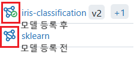

### 우리FISA 11주차 학습기록

#### ( 2025.03.17 ~ 2025.03.21 )

---

##### 2025.03.18. Tue

Airflow를 사용한 ML 파이프라인 구축

1. 필요한 모듈을 먼저 import
2. 필요로하는 변수, 함수 정의
3. DAG의 전반적인 정의
4. Task 정의
5. Task의 간의 순서를 작성 (누가봐도 어떤 작업인지 알 수 있게 작성)

실습하면서 알게된 점
.env 파일을 쓰려면

`from dotenv import load_dotenv` 한 후
`load_dotenv()`를 코드 맨 위에 넣어 실행해야한다.

### MLOps

#### MLOps의 성숙도 단계

1. MLOps 0단계: 수동 프로세스 (Manual Process)
2. MLOps 1단계: 부분적 자동화 (ML Pipeline Automation)
3. MLOps 2단계: 완전 자동화 (Full CI/CD & Continuous Training)
   ML 시스템의 완전 자동화를 목표로 함.

손을 안 대도 데이터 수집, 처리, 훈련, 배포까지 자동으로 되도록 하는 것

#### MLFlow

데이터브릭스(Databricks)에서 만든 ML 라이프 사이클을 End-to-end로 관리할 수 있는 오픈소스 툴
실험을 추적하고, 모델을 저장하며, 모델을 배포하는 것을 쉽게 만들어줍니다.
라이프사이클을 관리

`conda create --name fisa-ml`
`conda activate fisa-ml`
`pip install mlflow`
`mlflow ui`

mlflow 안에 experiment 이름을 만들어 놓고 연결

model registry
기존 모델 champion
비교 모델 challenger

register model

pip install ipykernel
python -m ipykernel install --user --name=fisa-ml --display-name "FISA-ML" - jupyter과 만든 커널을 연결

보통은 도커 컨테이너 안에서 훈련을 시키고 배포를 한다.
운영환경을 맞춰주기 위함

도커 실행해줘~ exec 명령어
docker exec -it 03_docker_with_mlflow-mlflow-server-1 python /root/train_files/train.py

#### MiniO

batch serving
모델의 학습 자체는 MLFlow에서 할 수 있고 데이터는 MiniO를 통해서 할 수 있다.
배치성으로 데이터를 추천하는 방법
사용자의 선호나 클릭에 따라 업데이트를 하는 방식이 아니라 데이터를 한꺼번에 처리

아웃풋 데이터도 심플 스토리지 서비스에 대해 저장해놓으면 버전이 올라가면서 가장 최신 버전을 쓰도록 반영된다.

bucket 만들기
buckets > Create bucket > Versioning on으로 전환

데이터는 보안이 중요하기 때문에 access key와 secret key를 할당해서 줄 수도 있다.

MLOps 파이프라인
Airflow - 여러 작업(예: 데이터 수집, 전처리, 모델 학습 등)을 정해진 시간에 자동으로 실행
MiniO - 수집된 데이터 저장 및 버전 확인
MLflow - 수집된 데이터를 가지고 여러 모델 학습 비교 (어떤 버전의 데이터에서 어떤 모델이 성능이 좋은지 알 수 있음)

---

#### 우리FISA 48일차 KPT

Keep : 수업 집중도 굿! 그냥 이해할 수 있다는 생각으로 들었더니 진짜 이해가 되는 듯 했다.

Problem : 전반적인 이해는 했지만 세세한 이해까지는 하지 못한 것 같아서 아쉽다. 미니 프로젝트 진행할 때, 누가 쫒아오는 것도 아닌데 마음이 조급해짐.

Try : 복습을 하면서 놓친 부분들을 꼭 메꾸기, 오류를 만나도 침착하기
