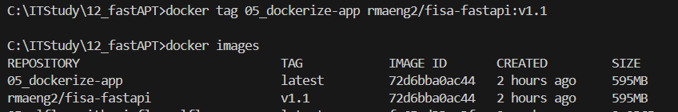

### 우리FISA 12주차 학습기록

#### ( 2025.04.07 ~ 2025.04.11 )

---

##### 2025.04.07. Mon

FastAPI

실행 'uvicorn main:app --reload --port 포트번호'

스웨거

summary

DATABASE_URL : 어떤 DB를 사용할 것인지 명시한다.
백엔드가 통신을 할 때는 세션단위로 통신한다.
세션메이커라는 걸 가지고 SQLAlchemy의 세션을 생성한다.

Depends()

models.py -> models.py
main.py -> main.py
form.py -> schemas.py

03 jinja template
pip install jinja2 : 진자 설치

alembic init alembic  
---
파이썬 기반의 가벼운 웹 프레임워크
비동기를 지원하는 Stalette라는 프레임워크를 통한 ASGI 기반
자동 OpenAPI 문서 생성 -> 테스팅툴 제공
pydantic을 이용한 강력한 데이터 검증

Fast API 다루기
pip install fastapi

uvicorn이라는 객체를 통해서 켜기

fastAPI는 서버가 아니라 프레임워크이다.
pydantic을 통한 베이스모델을 import해와서 자식클래스를 상속
예외처리까지 내장 되어있다.
페이지네이션 기능이 지원되어 있다.

Enum 3가지 자료형만 쓰겟다.

put
patch - 변경할 값만 받아서 수정

docker 이미지 만들기
docker compose up --build

opensearch - aws 버전의 ELK

(VPC) : 

curl -fsSL get.docker.com -o get-docker.sh
sh get-docker.sh

# sudo 없이 docker 사용하기
sudo groupadd docker / 도커 그룹 생성
sudo usermod -aG docker ${USER} / 현재 유저에게 권한 부여
sudo service docker restart / 도커 다시 시작
newgrp docker / 현재 도커 그룹에 반영

docker images / 아까 만든 이미지가 있는지 확인
docker tag 기존이미지명 도커허브id/레포지토리명:버전명
docker tag 05_dockerize-app rmaeng2/fisa-fastapi:v1.1
docker push atangi/fisa-fastapi:v1.1

# 원격 ec2에서
sudo docker run --env-file .env -e TZ=Asia/Seoul -p 80:8000 -d -t rmaeng2/fisa-fastapi:v1
TZ=Asia/Seoul : 타임존
-d : 백그라운드 모드 돌려려
-t : 인터랙티브 옵션

docker logs 이미지id앞 3자리

# 원격 ec2에서
# 현재 컨테이너 종료 후에
# 컨테이너 안에서 만들어지고 있는 logs 디렉토리를 컨테이너 밖에서 바인드마운트해서 사용하도록 
sudo docker run --env-file .env -e TZ=Asia/Seoul -p 80:8000 -d -t atangi/fisa-fastapi:v1